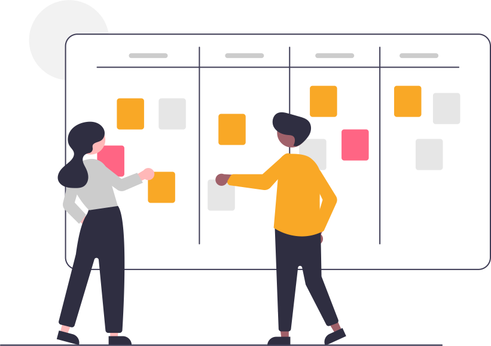

<section class="video">
    <h1 class="text-center">Um novo olhar sobre o futuro!</h1>
    <iframe id="video" src="https://www.youtube.com/embed/V6kS3fPytiQ" frameborder="0" allow="accelerometer; autoplay; encrypted-media; gyroscope; picture-in-picture" allowfullscreen></iframe>
</section>

<section class="apresentacao">
    <article class="container text-center text-dark">
        <h1>O Que é o Programa?</h1>
        
O Programa Practice objetiva estruturar ambientes e capacitar agentes educacionais para a produção e mediação de conteúdos por meio de tecnologias baseadas em metodologias ativas de modo a contribuir para a promoção da inovação no processo de ensino-aprendizagem em componentes curriculares e extracurriculares da UFFS.

    </article>
</section>

<section class="objetivos-container">
    

        

            <h2>Inovação e Educação</h2>
            <h1>Nossos Objetivo</h1>
            
_

        

        

            

                
                <h1>Estutura Multimidia</h1>
                
Estruturação e disponibilização de ambientes para a gravação, transmissão, edição e produção de conteúdos educacionais.

            
        
            

                
                <h1>Adaptação de Ambientes</h1>
                
Adaptação de algumas salas de aulas atuais para o oferecimento de aula em tempo real por telepresença.

            
        
            

                
                <h1>Capacitação</h1>
                
Capacitação didática de docentes para a oferta de aulas via telepresença da UFFS voltadas à interação, criação, curadoria e distribuição de conteúdos de acesso público

            
        
            

                
                <h1>UFFSTV</h1>
                
Plataforma exclusivamente digital, UFFSTV para distribuição de conteúdos de acesso público

            
       
            

                
                <h1>Suporte aos Estudantes e setotes da UFFS</h1>
                
Capacitação dos estudantes e sugestão de adequação de programas de Assistência Estudantil e adequação do acervo bibliotecário em plataforma digital

            
        
            

                
                <h1>Divulgação Ciêntifica</h1>
                
Contribuir para a curricularização da extensão a partir da produção de conteúdos voltados para a Educação Básica e os mais variados setores produtivos das iniciativas pública e privada.

            

        

    

</section>

<section class="frase text-center">
    
    <h1> O Futuro é agora, o Futuro é <strong>PRACTICE</strong></h1>
    
</section>

<section class="servico">
    

        <h2>Inovação e Educação</h2>
        <h1>Nossos Serviços</h1>
        
_

    

    

        <ol class="carousel-indicators">
          <li data-target="#carouselExampleIndicators" data-slide-to="0" class="active"></li>
          <li data-target="#carouselExampleIndicators" data-slide-to="1"></li>
          <li data-target="#carouselExampleIndicators" data-slide-to="2"></li>
          <li data-target="#carouselExampleIndicators" data-slide-to="3"></li>
          <li data-target="#carouselExampleIndicators" data-slide-to="4"></li>
        </ol>
        

          

            
            

                <h5>Fluxo de Trabalho</h5>
                
Utilizamos do método SCRUM e trabalhamos com Sprints de 14 dias de duração para a realização das nossas atividades

              

          

          

            
            

                <h5>Áudio e Vídeo</h5>
                
Para abranger o maior número de formatos que podem ser utilizados, a nossa equipe de media disponibiliza nossos formatos tanto para edição como para produção em nosso estúdio.

              

          

          

            
            

                <h5>Estúdio</h5>
                
Você precisa produzir vídeos com uma estrutura peculiar ou com recursos muito específicos? O serviço de estúdo do programa pode te ajudar

              

          

          

            
            

                <h5>Texto e Imagem</h5>
                
Equipe responsável pela criação de conteúdo de texto e imagem.

              

          

          

            
            

                <h5>Evento Virtual</h5>
                
Atuaçõa no auxilio na realização de eventos virtuai, como semanas acadêmicas.

              

          

        

        <a class="carousel-control-prev" href="#carouselExampleIndicators" role="button" data-slide="prev">
          
          Anterior
        </a>
        <a class="carousel-control-next" href="#carouselExampleIndicators" role="button" data-slide="next">
          
          Próximo
        </a>
      

</section>

<section class="contato">
<h1>Converse conosco</h1>

Estamos abertos para tirar dúvidas, receber críticas e novas ideias nos nossos portais de comunicaçãos

    
    
    
    
    

</section>
    